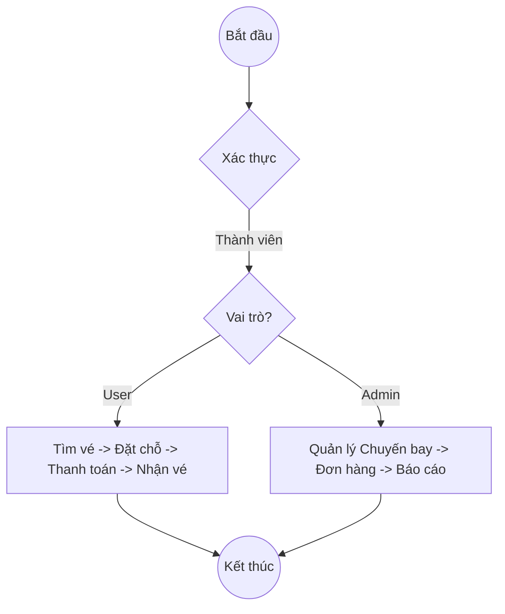
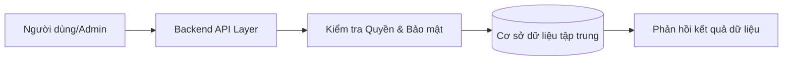

# Hệ Thống Bán Vé Máy Bay (VietjetSim) - Tài Liệu Chức Năng Chi Tiết

Tài liệu này hệ thống lại toàn bộ các tính năng, cấu trúc cơ sở dữ liệu và luồng nghiệp vụ của dự án theo yêu cầu chi tiết.

---

## 1. Vai Trò Người Dùng (User)

### 1.1 Quản lý Tài khoản
- **Đăng ký / Đăng nhập**: Tạo tài khoản khách hàng mới.
- **Xác thực**: Hỗ trợ xác thực qua Email/JWT để bảo mật phiên làm việc.
- **Hồ sơ cá nhân**: Cập nhật thông tin liên lạc, số điện thoại, ảnh đại diện.

### 1.2 Tìm kiếm & Đặt vé
- **Tìm kiếm chuyến bay**:
  - Nhập điểm đi, điểm đến.
  - Chọn ngày đi, ngày về (khứ hồi) và số lượng hành khách.
- **Xem kết quả & Lọc**:
  - Hiển thị danh sách chuyến bay khả dụng.
  - Bộ lọc thông minh: Sắp xếp theo giá, giờ cất cánh/hạ cánh, hãng bay và hạng ghế.
- **Chọn chuyến & Đặt vé**: 
  - Chọn hạng vé phù hợp: **Eco** (Phổ thông), **Deluxe**, **SkyBoss** (Thương gia), hoặc **First Class** (Hạng Nhất - nếu có).
  - **Nhập thông tin hành khách**: Họ tên, ngày sinh, giấy tờ tùy thân.
  - **Chọn chỗ ngồi**: Xem sơ đồ ghế ngồi trực quan và chọn vị trí yêu thích.

### 1.3 Thanh toán & Nhận vé
- **Cơ chế Thuế & Phí**: Tự động tính toán Thuế sân bay, Phí quản trị, Phí soi chiếu và Phí xăng dầu vào tổng tiền cuối cùng.
- **Đa dạng phương thức**: Thẻ tín dụng/ghi nợ, Ví điện tử (MoMo, ZaloPay), Chuyển khoản ngân hàng.
- **Nhận vé điện tử (e-ticket)**:
  - Hiển thị mã đặt chỗ ngay sau khi thanh toán.
  - Hỗ trợ tải vé PDF, gửi thông báo qua Email hoặc SMS.

### 1.4 Quản lý Sau đặt vé
- **Quản lý đặt chỗ**: Xem lại lịch sử các chuyến bay đã đặt.
- **Thay đổi dịch vụ**: Đổi chuyến, hủy vé hoặc yêu cầu hoàn vé (theo chính sách).
- **Check-in trực tuyến**: Làm thủ tục sớm, chọn ghế chính thức và in thẻ lên máy bay (Boarding Pass).

---

## 2. Vai Trò Quản Trị Viên (Admin)

### 2.1 Quản lý Vận hành
- **Quản lý chuyến bay**: 
  - Thêm mới lịch bay, cập nhật giờ bay.
  - Xóa hoặc tạm dừng các tuyến bay không hoạt động.
- **Quản lý giá vé & Hạng ghế**: 
  - Điều chỉnh giá vé linh hoạt cho các hạng Economy, Business, First class.
  - Cấu hình phí dịch vụ và thuế bổ sung cho từng tuyến bay.
- **Quản lý đơn đặt vé**: 
  - Xem danh sách toàn bộ Booking trên hệ thống.
  - Phê duyệt/Từ chối yêu cầu **Hoàn tiền & Hủy vé** dựa trên chính sách hạng vé.
  - Xác nhận thủ công hoặc hủy các đơn đặt chỗ có vấn đề.

### 2.2 Quản lý Tài nguyên & Hệ thống
- **Quản lý người dùng**: Phân quyền (RBAC), khóa tài khoản vi phạm hoặc hỗ trợ đổi vai trò.
- **Quản lý thanh toán**: Theo dõi lịch sử giao dịch, xác nhận tiền về và thực hiện lệnh hoàn tiền.
- **Khuyến mãi & Thông báo**: Tạo mã giảm giá (Promo code), lập chiến dịch gửi email marketing.
- **Cài đặt hệ thống**: Cấu hình cổng thanh toán, tùy chọn ngôn ngữ và thiết lập bảo mật (CSRF, Rate limit).

### 2.3 Báo cáo & Phân tích
- **Thống kê doanh thu**: Theo ngày, tháng, năm hoặc theo từng tuyến bay.
- **Báo cáo vận hành**: Tỷ lệ ghế trống, xu hướng đặt vé của khách hàng.

---

## 3. Kiến Trúc Backend & Cơ Sở Dữ Liệu (DB)

Hệ thống được thiết kế theo kiến trúc tập trung với các phân khu dữ liệu:
- **DB Chuyến bay**: Lưu trữ lịch trình, sơ đồ ghế, trạng thái ghế và bảng giá.
- **DB Đặt vé**: Lưu trữ thông tin Booking, dữ liệu hành khách và mã vé điện tử.
- **DB Người dùng**: Lưu trữ tài khoản, mật khẩu (đã hash), hồ sơ và phân quyền.
- **Thanh toán & Log**: Lưu trữ nhật ký giao dịch và lịch sử hoạt động hệ thống (audit logs).

---

## 4. Sơ Đồ Luồng Xử Lý (Mermaid)

### 4.1 Luồng Tổng Quát Người dùng & Admin

### 4.2 Luồng Logic Backend dùng chung

---
*Tài liệu được biên soạn dựa trên cấu trúc hệ thống VietjetSim thực tế.*
