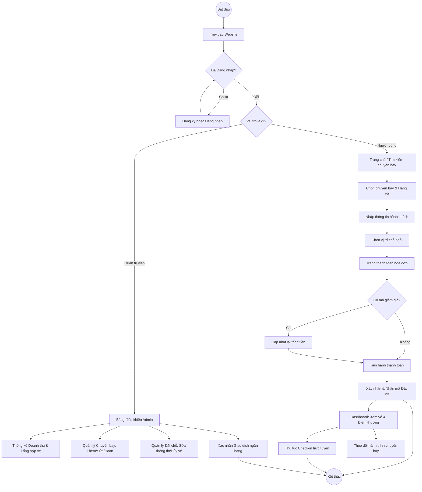
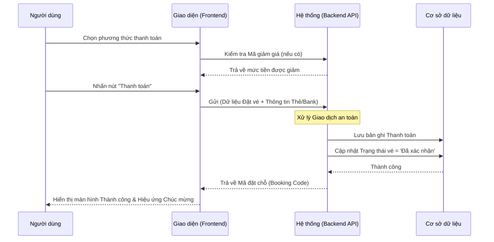
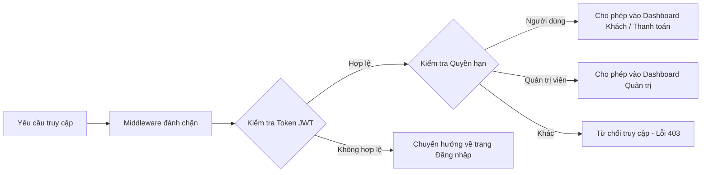
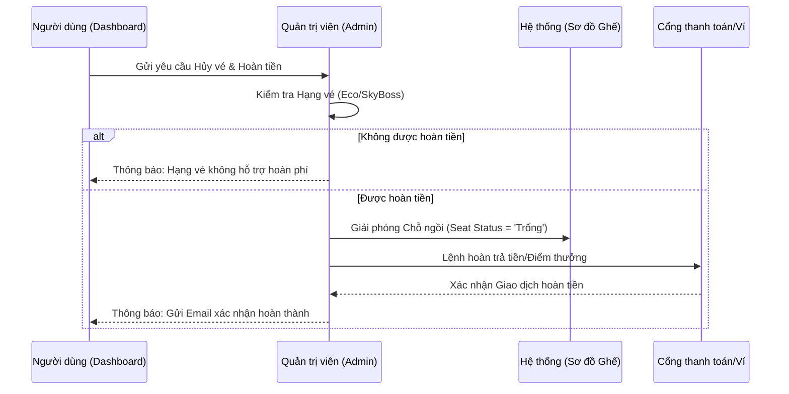
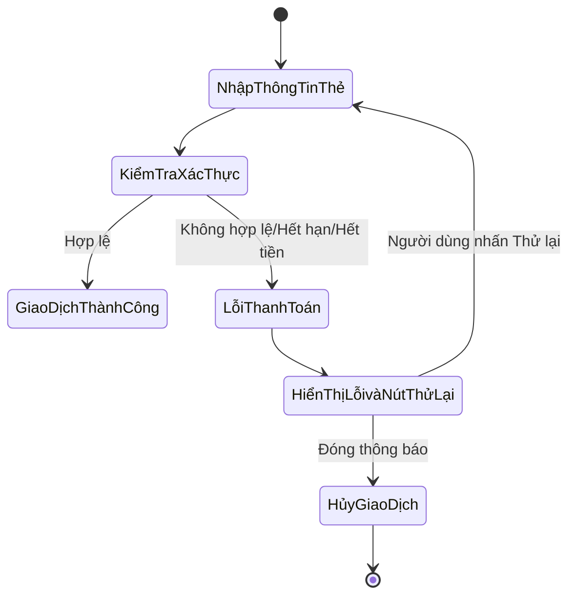

# Sơ đồ Luồng Xử lý Dự án (VietjetSim)

Dưới đây là sơ đồ chi tiết các bước xử lý nghiệp vụ trong hệ thống VietjetSim sử dụng Mermaid.

## 1. Tổng quan Luồng Người Dùng & Quản Trị Viên

---

## 2. Luồng Thanh toán Chi tiết

---

## 3. Quy trình Kiểm soát Truy cập (Middleware)

---

## 4. Luồng Hoàn tiền & Hủy vé (Hoàn chỉnh)

---

## 5. Luồng Xử lý Lỗi Thanh toán

